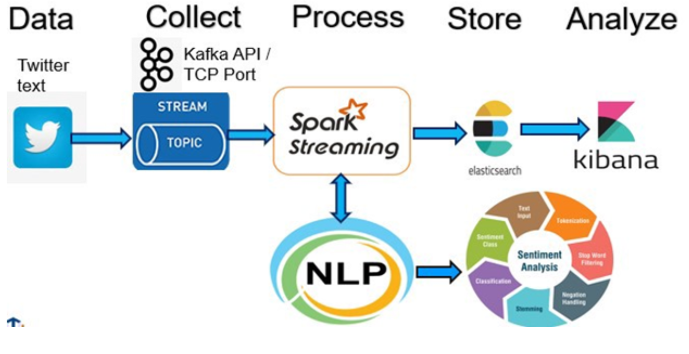

# Proyecto de Pipeline de Análisis de Sentimientos de Tweets

Este proyecto implementa una pipeline de análisis de sentimientos de tweets utilizando Kafka, Spark y Elasticsearch. Los tweets se leen desde un archivo CSV, se envían a Kafka, se procesan con Spark y finalmente se almacenan en Elasticsearch para su búsqueda y análisis.

## Arquitectura a montar

<div style="width: 70%; margin: auto; text-align: center;">
    
</div>

## Descripción General

El objetivo de este proyecto es procesar tweets para realizar un análisis de sentimientos. La pipeline de procesamiento incluye los siguientes pasos:
1. Lectura de tweets desde un archivo CSV.
2. Envío de los tweets a Kafka.
3. Procesamiento de los tweets con Spark.
4. Almacenamiento de los resultados en Elasticsearch.
5. Visualización de los datos en Kibana.
6. Análisis interactivo utilizando Jupyter Notebook.

## Servicios

### 1. Zookeeper
- **Imagen:** `confluentinc/cp-zookeeper:7.6.1`
- **Descripción:** Servicio para gestionar el clúster de Kafka.
- **Puertos:** 22181:2181
- **Volúmenes:** `zookeeper_data:/var/lib/zookeeper`

### 2. Kafka Brokers
- **Imágenes:** `confluentinc/cp-kafka:7.6.1`
- **Descripción:** Servicios de mensajería para la ingestión de tweets.
- **Puertos:** 
  - kafka1: 9092:9092
  - kafka2: 9093:9092
  - kafka3: 9094:9092
- **Volúmenes:** 
  - kafka1: `kafka1_data:/var/lib/kafka`
  - kafka2: `kafka2_data:/var/lib/kafka`
  - kafka3: `kafka3_data:/var/lib/kafka`

### 3. Schema Registry
- **Imagen:** `confluentinc/cp-schema-registry:7.6.1`
- **Descripción:** Servicio para gestionar esquemas de datos.
- **Puertos:** 8081:8081
- **Volúmenes:** `schema_registry_data:/var/lib/schema-registry`

### 4. Spark Master
- **Imagen:** `bitnami/spark:3.5.1`
- **Descripción:** Nodo maestro de Spark para el procesamiento de datos.
- **Puertos:** 
  - 8080:8080
  - 7077:7077
- **Volúmenes:** `spark_master_data:/opt/bitnami/spark`

### 5. Spark Worker
- **Imagen:** `bitnami/spark:3.5.1`
- **Descripción:** Nodo trabajador de Spark que ejecuta tareas.
- **Volúmenes:** `spark_worker_data:/opt/bitnami/spark`

### 6. Spark Submit
- **Dockerfile:** `./spark/Dockerfile`
- **Descripción:** Servicio para enviar trabajos a Spark.
- **Volúmenes:** 
  - `spark_submit_data:/opt/bitnami/spark`
  - `nltk_data:/opt/bitnami/nltk_data`

### 7. Servicio de Lectura de Tweets
- **Dockerfile:** `./leer_tweets/Dockerfile`
- **Descripción:** Servicio para leer tweets desde un archivo CSV y enviarlos a Kafka.
- **Comando:** `python -u producer.py`
- **Volúmenes:** 
  - `./leer_tweets/:/app`
  - `./data/:/data`

### 8. Jupyter Notebook
- **Imagen:** `jupyter/pyspark-notebook`
- **Descripción:** Entorno interactivo para trabajar con datos en Spark.
- **Puertos:** 8888:8888
- **Volúmenes:** `./spark/notebooks:/home/jovyan/work`

### 9. Elasticsearch
- **Imagen:** `docker.elastic.co/elasticsearch/elasticsearch:7.9.3`
- **Descripción:** Servicio de almacenamiento y búsqueda de datos.
- **Puertos:** 
  - 9200:9200
  - 9300:9300
- **Volúmenes:** `es_data:/usr/share/elasticsearch/data`

### 10. Kibana
- **Imagen:** `docker.elastic.co/kibana/kibana:7.9.3`
- **Descripción:** Interfaz web para visualizar y analizar datos en Elasticsearch.
- **Puertos:** 5601:5601

## Archivos Docker

### Dockerfile del Servicio `leer_tweets`

Este Dockerfile realiza los siguientes pasos:

1. **Base Image**: Usa la imagen base `python:3.10.12-alpine`, que es una versión ligera de Python.
2. **Directorio de Trabajo**: Establece el directorio de trabajo en `/app`.
3. **Instalación de Dependencias**:
   - Copia `requirements.txt` al directorio de trabajo.
   - Instala las dependencias listadas en `requirements.txt` usando `pip`.
4. **Copia de Archivos**:
   - Copia el script `producer.py` al directorio de trabajo.
   - Copia el archivo de datos `tweets.csv` al directorio `/data`.
5. **Comando de Ejecución**: Define el comando para ejecutar el script `producer.py` utilizando Python.

```dockerfile
FROM python:3.10.12-alpine

# Establece el directorio de trabajo
WORKDIR /app

# Instala dependencias
COPY ./requirements.txt .
RUN pip install --no-cache-dir -r requirements.txt

# Copia los scripts y datos necesarios
COPY ./leer_tweets/producer.py /app/producer.py
COPY ./data/tweets.csv /data/tweets.csv

# Comando para ejecutar el script
CMD ["python", "-u", "producer.py"]
```

### Dockerfile de `spark-submit`

Este Dockerfile realiza los siguientes pasos:

1. **Base Image**: Utiliza `bitnami/spark:3.5.1`.
2. **Directorio de Trabajo**: Establece `/app` como el directorio de trabajo.
3. **Instalación de Dependencias**:
   - Copia `requirements.txt` al directorio de trabajo.
   - Instala las dependencias listadas en `requirements.txt` usando `pip`.
4. **Copia de Archivos**:
   - Copia el script `transform_kafka_streaming.py` al directorio de trabajo.
5. **Comando de Ejecución**: Define el comando que ejecuta el script `transform_kafka_streaming.py` usando `spark-submit` con los paquetes necesarios.

```dockerfile
FROM bitnami/spark:3.5.1

# Cambia al usuario root
USER root

# Crea el directorio y cambia los permisos
RUN mkdir -p /opt/bitnami/spark && chmod -R 777 /opt/bitnami/spark

# Copiar el archivo requirements.txt desde el directorio padre
COPY ../requirements.txt /opt/bitnami/

# Instalar las dependencias /opt/bitnami/
RUN pip install --upgrade pip
RUN pip install -r /opt/bitnami/requirements.txt

# Crear un directorio para los datos de NLTK y establecer permisos
RUN mkdir -p /opt/bitnami/nltk_data && chmod -R 777 /opt/bitnami/nltk_data

# Configurar la variable de entorno NLTK_DATA
ENV NLTK_DATA=/opt/bitnami/nltk_data

# Instalar textblob corpora
RUN python -m textblob.download_corpora

# Copiar el script de PySpark
COPY ./spark/transform_kafka_streaming.py /opt/bitnami/spark/transform_kafka_streaming.py

ENTRYPOINT ["/opt/bitnami/scripts/spark/entrypoint.sh"]
CMD ["spark-submit", "--master", "spark://spark-master:7077", "--packages", "org.apache.spark:spark-sql-kafka-0-10_2.12:3.5.1", "/opt/bitnami/spark/transform_kafka_streaming.py"]
```

## Scripts

### `producer.py` del Servicio `leer_tweets`

Este script de Python, `producer.py`, realiza los siguientes pasos para enviar mensajes de un archivo CSV a un clúster de Kafka:

1. **Importaciones**:
   - Importa librerías necesarias para trabajar con Kafka (`kafka-python`), manejar archivos CSV, realizar peticiones HTTP (`requests`), y manejar el tiempo y la generación de números aleatorios.

2. **Configuración de Kafka**:
   - Define los servidores de arranque (`bootstrap_servers`) para los tres brokers de Kafka.
   - Define la ruta al archivo CSV que contiene los tweets.

3. **Esperar a que Kafka esté disponible**:
   - La función `esperar_kafka` verifica continuamente si Kafka está disponible intentando listar los temas. Si Kafka no está disponible, espera 5 segundos y vuelve a intentarlo.

4. **Crear un tema en Kafka si no existe**:
   - La función `crear_topic_si_no_existe` crea un nuevo tema en Kafka con el nombre especificado si no existe. Define el tema con una partición y tres réplicas.

5.

 **Enviar mensajes a Kafka**:
   - La función `enviar_a_kafka` envía un mensaje codificado en UTF-8 a un tema específico en Kafka.

6. **Leer un archivo CSV y enviar mensajes a Kafka**:
   - La función `leer_csv_y_enviar` abre el archivo CSV y cuenta el número total de filas.
   - En un bucle infinito, selecciona una fila aleatoria del archivo CSV, forma un mensaje a partir de la fila y lo envía a Kafka utilizando la función `enviar_a_kafka`.
   - Espera 5 segundos antes de enviar el siguiente mensaje.

7. **Ejecución del script**:
   - Llama a `esperar_kafka` para asegurarse de que Kafka está disponible.
   - Define el nombre del tema como `topic_tweets`.
   - Llama a `crear_topic_si_no_existe` para crear el tema si no existe.
   - Llama a `leer_csv_y_enviar` para comenzar a leer el archivo CSV y enviar mensajes a Kafka.


```python
import csv
import time
import random
import requests
from kafka.admin import KafkaAdminClient, NewTopic
from kafka import KafkaProducer

# Actualiza bootstrap_servers para incluir los tres brokers de Kafka
bootstrap_servers = ['kafka1:9092', 'kafka2:9093', 'kafka3:9094']
archivo_csv = '/data/tweets.csv'

def esperar_kafka():
    while True:
        try:
            admin_client = KafkaAdminClient(bootstrap_servers=bootstrap_servers)
            admin_client.list_topics()
            print('*********** KAFKA ESTÁ DISPONIBLE **************')
            return
        except Exception as e:
            print(':( :( :( :( :( :( :( :( :( :( :( Kafka no está disponible aún :( :( :( :( :( :( :( :( :( :( ')
            print(f'Error: {e}')
            time.sleep(5)

def crear_topic_si_no_existe(topic_name):
    admin_client = KafkaAdminClient(bootstrap_servers=bootstrap_servers)
    topics = admin_client.list_topics()
    topic_exists = any(topic_name == topic for topic in topics)
    if not topic_exists:
        new_topic = NewTopic(name=topic_name, num_partitions=1, replication_factor=3)  # Aquí se puede ajustar el número de particiones y réplicas
        admin_client.create_topics(new_topics=[new_topic], validate_only=False)
        print(f'Topic {topic_name} creado con éxito. :) :) :) :) :) :)')

def enviar_a_kafka(producer, topic_name, mensaje):
    producer.send(topic_name, mensaje.encode('utf-8'))
    producer.flush()
    print(f'Mensaje enviado al topic "{topic_name}": {mensaje}')

def leer_csv_y_enviar(topic_name):
    producer = KafkaProducer(bootstrap_servers=bootstrap_servers)
    # Ajustando la lectura del archivo para manejar posibles errores de codificación
    try:
        with open(archivo_csv, mode='r', encoding='utf-8', errors='replace') as csvfile:
            total_filas = sum(1 for row in csvfile)
        with open(archivo_csv, mode='r', encoding='utf-8', errors='replace') as csvfile:
            reader = csv.reader(csvfile)
            while True:
                fila_aleatoria = random.randint(1, total_filas - 1)
                csvfile.seek(0)
                for i, fila in enumerate(reader):
                    if i == fila_aleatoria:
                        mensaje = ','.join(fila)
                        enviar_a_kafka(producer, topic_name, mensaje)
                        break
                time.sleep(5)
    except Exception as e:
        print(f'Error al leer el archivo CSV: {e}')
    producer.close()

esperar_kafka()
topic_name = 'topic_tweets'
crear_topic_si_no_existe(topic_name)
leer_csv_y_enviar(topic_name)
```

### `transform_kafka_streaming.py` para Spark

Este script configura un pipeline de procesamiento de datos en Apache Spark para leer tweets de Kafka, realizar transformaciones y análisis de sentimientos, y luego escribir los resultados en la consola y en Elasticsearch.

### Descripción Breve del Script

1. **Configuración de la Sesión de Spark**:
   - Crea una sesión de Spark con la aplicación nombrada "KafkaToElasticsearch".
   - Especifica el maestro de Spark (`spark-master:7077`).
   - Configura los paquetes necesarios para conectar con Elasticsearch y Kafka.

2. **Definición de Funciones**:
   - `convert_day`: Convierte un día abreviado (e.g., "Mon") en su forma completa (e.g., "Monday").
   - `convert_month_long`: Convierte un mes abreviado (e.g., "Jan") en su forma completa (e.g., "January").
   - `get_sentiment`: Asigna un sentimiento aleatorio ("positive", "negative", "neutral") a un texto.

3. **Definición de UDFs (User-Defined Functions)**:
   - Crea UDFs para convertir días y meses, y para analizar el sentimiento del texto.

4. **Lectura de Datos desde Kafka**:
   - Configura la lectura de un stream de Kafka desde el tema `topic_tweets`.
   - Define los brokers de Kafka (`kafka1:9092`, `kafka2:9093`, `kafka3:9094`).

5. **Procesamiento de Datos**:
   - Convierte los valores de los mensajes de Kafka en texto (string).
   - Divide el texto en columnas específicas basadas en comas.
   - Extrae y transforma las columnas correspondientes a las fechas y otros campos.

6. **Transformaciones Adicionales**:
   - Convierte los días y meses abreviados en su forma completa.
   - Extrae partes específicas de la fecha (día, mes, año, hora, minuto, segundo) y las combina en una columna de fecha.
   - Añade una columna de sentimiento usando el UDF correspondiente.

7. **Escritura de Datos en la Consola**:
   - Configura la escritura del stream de datos procesados en la consola en modo de salida "append".

8. **Escritura de Datos en Elasticsearch**:
   - Configura la escritura del stream de datos procesados en Elasticsearch.
   - Especifica la ubicación del checkpoint, los nodos de Elasticsearch, el puerto, y el índice de Elasticsearch (`indice_tweets/_doc`).

9. **Ejecución de los Streams**:
   - Inicia ambos streams de escritura y espera su terminación.

## Ejemplo de Salida en Consola

```
+--------------------+-----+----------+--------------------+--------+--------------+--------------------+---------+-----------+---------+----------+---+-----+----+--------+----+------+------+--------+----------+
|                 raw|label|       isa|            datelong|    flag|          user|                text|day_short|month_short| day_long|month_long|day|month|year|    time|hour|minute|second|    date| sentiment|
+--------------------+-----+----------+--------------------+--------+--------------+--------------------+---------+-----------+---------+----------+---+-----+----+--------+----+------+------+--------+----------+
|0,2014352418,Wed ...|    0|2014352418|Wed Jun 03 01:14:...|NO_QUERY|emmacourtney85|@scholesy111 Didn...|      Wed|        Jun|Wednesday|      June| 03|   06|2009|01:14:47|  01|    14|    47|03062009|  positive|
+--------------------+-----+----------+--------------------+--------+--------------+--------------------+---------+-----------+---------+----------+---+-----+----+--------+----+------+------+--------+----------+
```

## Script de Transformación y Procesamiento de Datos

```python
from pyspark.sql import SparkSession
from pyspark.sql.functions import col, split, udf, lpad, concat
from pyspark.sql.types import StringType, IntegerType
import random

# Crear la sesión de Spark
spark = SparkSession.builder \
    .appName("KafkaToElasticsearch") \
    .master("spark://spark-master:7077") \
    .config("spark.jars.packages", "org.elasticsearch:elasticsearch-spark-30_2.12:7.9.3,org.apache.spark:spark-sql-kafka-0-10_2.12:3.5.1") \
    .getOrCreate()

# Funciones para convertir día, mes y analizar sentimiento
def convert_day(day):
    days = {'Mon': 'Monday', 'Tue': 'Tuesday', 'Wed': 'Wednesday', 'Thu': 'Thursday', 'Fri': 'Friday', 'Sat': 'Saturday', 'Sun': 'Sunday'}
    return days.get(day, day)

def convert_month_long(month):
    months = {'Jan': 'January', 'Feb': 'February', 'Mar': 'March', 'Apr': 'April', 'May': 'May', 'Jun': 'June',
            'Jul': 'July', 'Aug': 'August', 'Sep': 'September', 'Oct': 'October', 'Nov': 'November', 'Dec': 'December'}
    return months.get(month, 'Unknown')

def get_sentiment(text):
    sentimientos = ["positive", "negative", "neutral"]
    return random.choice(sentimientos)

convert_day_udf = udf(convert_day, StringType())
convert_month_long_udf = udf(convert_month_long, StringType())
sentiment_udf = udf(get_sentiment, StringType())

# Leer datos

 desde Kafka
df = spark.readStream \
    .format("kafka") \
    .option("kafka.bootstrap.servers", "kafka1:9092,kafka2:9093,kafka3:9094") \
    .option("subscribe", "topic_tweets") \
    .option("startingOffsets", "latest") \
    .load()

# Procesar datos
tweets = df.selectExpr("CAST(value AS STRING) as raw")
columnas = split(tweets['raw'], ',')
parsed_tweets = tweets.withColumn("label", columnas.getItem(0).cast("string")) \
    .withColumn("isa", columnas.getItem(1).cast("string")) \
    .withColumn("datelong", columnas.getItem(2).cast("string")) \
    .withColumn("flag", columnas.getItem(3).cast("string")) \
    .withColumn("user", columnas.getItem(4).cast("string")) \
    .withColumn("text", columnas.getItem(5).cast("string"))

parsed_tweets = parsed_tweets.withColumn("day_short", split(col("datelong"), ' ').getItem(0)) \
    .withColumn("month_short", split(col("datelong"), ' ').getItem(1)) \
    .withColumn("day_long", convert_day_udf(col("day_short"))) \
    .withColumn("month_long", convert_month_long_udf(col("month_short"))) \
    .withColumn("day", split(col("datelong"), ' ').getItem(2).cast(IntegerType())) \
    .withColumn("month", lpad(split(col("datelong"), ' ').getItem(1), 2, '0').cast(IntegerType())) \
    .withColumn("year", split(col("datelong"), ' ').getItem(5).cast(IntegerType())) \
    .withColumn("time", split(col("datelong"), ' ').getItem(3)) \
    .withColumn("hour", split(col("time"), ':').getItem(0).cast(IntegerType())) \
    .withColumn("minute", split(col("time"), ':').getItem(1).cast(IntegerType())) \
    .withColumn("second", split(col("time"), ':').getItem(2).cast(IntegerType())) \
    .withColumn("date", concat(col("year"), lpad(col("month"), 2, '0'), lpad(col("day"), 2, '0')))

parsed_tweets = parsed_tweets.withColumn("sentiment", sentiment_udf(col("text")))

# Escribir datos en consola
query_console = parsed_tweets.writeStream \
    .outputMode("append") \
    .format("console") \
    .option("truncate", "false") \
    .start()

# Escribir datos en Elasticsearch
query_elasticsearch = parsed_tweets.writeStream \
    .outputMode("append") \
    .format("org.elasticsearch.spark.sql") \
    .option("checkpointLocation", "/tmp/") \
    .option("es.nodes", "elasticsearch") \
    .option("es.port", "9200") \
    .option("es.index.auto.create", "true") \
    .option("es.resource", "indice_tweets/_doc") \
    .start()

# Esperar a que ambos streams terminen
query_console.awaitTermination()
query_elasticsearch.awaitTermination()
```

## Redes

### red-proyecto
- **Driver:** bridge

## Volúmenes

- `zookeeper_data`
- `kafka1_data`
- `kafka2_data`
- `kafka3_data`
- `schema_registry_data`
- `spark_master_data`
- `spark_worker_data`
- `spark_submit_data`
- `nltk_data`
- `es_data`

## Ejecución del Proyecto

Para ejecutar este proyecto, asegúrate de tener Docker y Docker Compose instalados en tu sistema. Luego, ejecuta el siguiente comando en la raíz del proyecto para iniciar todos los servicios:

```bash
docker-compose up
```

Esto descargará las imágenes necesarias, construirá los contenedores y levantará todos los servicios definidos en el archivo `docker-compose.yml`.

## Consideraciones Adicionales

- **Monitoreo y Logs:** Los logs de cada servicio se pueden consultar utilizando el comando `docker-compose logs <service_name>`.
- **Persistencia de Datos:** Asegúrate de que los volúmenes de datos están correctamente configurados para la persistencia de datos entre reinicios.
- **Configuraciones:** Puedes ajustar las configuraciones de cada servicio en el archivo `docker-compose.yml` según tus necesidades específicas.

Si tienes alguna pregunta o encuentras algún problema, no dudes en abrir un issue en este repositorio.

¡Gracias por utilizar este proyecto!