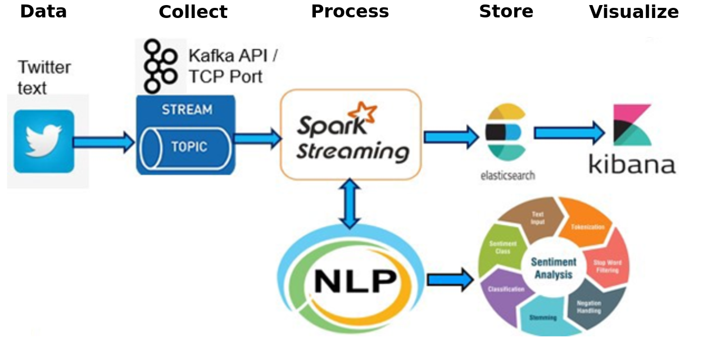

# Proyecto de Pipeline de Análisis de Sentimientos de Tweets

Este proyecto implementa una pipeline de análisis de sentimientos de tweets utilizando Kafka, Spark y Elasticsearch. Los tweets se leen desde un archivo CSV, se envían a Kafka, se procesan con Spark y finalmente se almacenan en Elasticsearch para su búsqueda y análisis.

## Arquitectura a montar

<div style="width: 70%; margin: auto; text-align: center;">
    
</div>

## Descripción General

El objetivo de este proyecto es procesar tweets para realizar un análisis de sentimientos. La pipeline de procesamiento incluye los siguientes pasos:
1. Lectura de tweets desde un archivo CSV.
2. Envío de los tweets a Kafka.
3. Procesamiento de los tweets con Spark.
4. Almacenamiento de los resultados en Elasticsearch.
5. Visualización de los datos en Kibana.
6. Análisis interactivo utilizando Jupyter Notebook.

## Servicios

### 1. Zookeeper
- **Imagen:** `confluentinc/cp-zookeeper:latest`
- **Descripción:** Servicio para gestionar el clúster de Kafka.
- **Puertos:** 22181:2181
- **Volúmenes:** `zookeeper_data:/var/lib/zookeeper`

### 2. Kafka Brokers
- **Imágenes:** `confluentinc/cp-kafka:latest`
- **Descripción:** Servicios de mensajería para la ingestión de tweets.
- **Puertos:** 
  - kafka1: 9092:9092
  - kafka2: 9093:9092
  - kafka3: 9094:9092
- **Volúmenes:** 
  - kafka1: `kafka1_data:/var/lib/kafka`
  - kafka2: `kafka2_data:/var/lib/kafka`
  - kafka3: `kafka3_data:/var/lib/kafka`

### 3. Schema Registry
- **Imagen:** `confluentinc/cp-schema-registry:7.3.0`
- **Descripción:** Servicio para gestionar esquemas de datos.
- **Puertos:** 8081:8081
- **Volúmenes:** `schema_registry_data:/var/lib/schema-registry`

### 4. Spark Master
- **Imagen:** `bitnami/spark:latest`
- **Descripción:** Nodo maestro de Spark para el procesamiento de datos.
- **Puertos:** 
  - 8080:8080
  - 7077:7077
- **Volúmenes:** `spark_master_data:/opt/bitnami/spark`

### 5. Spark Worker
- **Imagen:** `bitnami/spark:latest`
- **Descripción:** Nodo trabajador de Spark que ejecuta tareas.
- **Volúmenes:** `spark_worker_data:/opt/bitnami/spark`

### 6. Spark Submit
- **Dockerfile:** `./spark/Dockerfile`
- **Descripción:** Servicio para enviar trabajos a Spark.
- **Volúmenes:** 
  - `spark_submit_data:/opt/bitnami/spark`
  - `nltk_data:/opt/bitnami/nltk_data`

### 7. Servicio de Lectura de Tweets
- **Dockerfile:** `./leer_tweets/Dockerfile`
- **Descripción:** Servicio para leer tweets desde un archivo CSV y enviarlos a Kafka.
- **Comando:** `python -u producer.py`
- **Volúmenes:** 
  - `./leer_tweets/:/app`
  - `./data/:/data`

### 8. Jupyter Notebook
- **Imagen:** `jupyter/pyspark-notebook`
- **Descripción:** Entorno interactivo para trabajar con datos en Spark.
- **Puertos:** 8888:8888
- **Volúmenes:** `./spark/notebooks:/home/jovyan/work`

### 9. Elasticsearch
- **Imagen:** `docker.elastic.co/elasticsearch/elasticsearch:7.9.3`
- **Descripción:** Servicio de almacenamiento y búsqueda de datos.
- **Puertos:** 
  - 9200:9200
  - 9300:9300
- **Volúmenes:** `es_data:/usr/share/elasticsearch/data`

### 10. Kibana
- **Imagen:** `docker.elastic.co/kibana/kibana:7.9.3`
- **Descripción:** Interfaz web para visualizar y analizar datos en Elasticsearch.
- **Puertos:** 5601:5601

## Archivos Docker

### Dockerfile del Servicio `leer_tweets`

```dockerfile
FROM python:3.10.12-alpine

# Establece el directorio de trabajo
WORKDIR /app

# Instala dependencias
COPY ./requirements.txt .
RUN pip install --no-cache-dir -r requirements.txt

# Copia los scripts y datos necesarios
COPY ./leer_tweets/producer.py /app/producer.py
COPY ./data/tweets.csv /data/tweets.csv

# Comando para ejecutar el script
CMD ["python", "-u", "producer.py"]
```

### Dockerfile de `spark-submit`

```dockerfile
FROM bitnami/spark:latest

# Cambia al usuario root
USER root

# Crea el directorio y cambia los permisos
RUN mkdir -p /opt/bitnami/spark && chmod -R 777 /opt/bitnami/spark

# Copiar el archivo requirements.txt desde el directorio padre
COPY ../requirements.txt /opt/bitnami/

# Instalar las dependencias /opt/bitnami/
RUN pip install --upgrade pip
RUN pip install -r /opt/bitnami/requirements.txt

# Crear un directorio para los datos de NLTK y establecer permisos
RUN mkdir -p /opt/bitnami/nltk_data && chmod -R 777 /opt/bitnami/nltk_data

# Configurar la variable de entorno NLTK_DATA
ENV NLTK_DATA=/opt/bitnami/nltk_data

# Instalar textblob corpora
RUN python -m textblob.download_corpora

# Copiar el script de PySpark
COPY ./spark/transform_kafka_streaming.py /opt/bitnami/spark/transform_kafka_streaming.py

ENTRYPOINT ["/opt/bitnami/scripts/spark/entrypoint.sh"]
CMD ["spark-submit", "--master", "spark://spark-master:7077", "--packages", "org.apache.spark:spark-sql-kafka-0-10_2.12:3.5.1", "/opt/bitnami/spark/transform_kafka_streaming.py"]
```

## Scripts

### `producer.py` del Servicio `leer_tweets`

```python
import csv
import time
import random
import requests
from kafka.admin import KafkaAdminClient, NewTopic
from kafka import KafkaProducer

# Actualiza bootstrap_servers para incluir los tres brokers de Kafka
bootstrap_servers = ['kafka1:9092', 'kafka2:9093', 'kafka3:9094']
archivo_csv = '/data/tweets.csv'

def esperar_kafka():
    while True:
        try:
            admin_client = KafkaAdminClient(bootstrap_servers=bootstrap_servers)
            admin_client.list_topics()
            print('*********** KAFKA ESTÁ DISPONIBLE **************')
            return
        except Exception as e:
            print(':( :( :( :( :( :( :( :( :( :( :( Kafka no está disponible aún :( :( :( :( :( :( :( :( :( :( ')
            print(f'Error: {e}')
            time.sleep(5)

def crear_topic_si_no_existe(topic_name):
    admin_client = KafkaAdminClient(bootstrap_servers=bootstrap_servers)
    topics = admin_client.list_topics()
    topic_exists = any(topic_name == topic for topic in topics)
    if not topic_exists:
        new_topic = NewTopic(name=topic_name, num_partitions=1, replication_factor=3)
        admin_client.create_topics(new_topics=[new_topic], validate_only=False)
        print(f'Topic {topic_name} creado con éxito. :) :) :) :) :) :)')

def enviar_a_kafka(producer, topic_name, mensaje):
    producer.send(topic_name, mensaje.encode('utf-8'))
    producer.flush()
    print(f'Mensaje enviado al topic "{topic_name}": {mensaje}')

def leer_csv_y_enviar(topic_name):
    producer = KafkaProducer(bootstrap_servers=bootstrap_servers)
    try:
        with open(archivo_csv, mode='r', encoding='utf-8', errors='replace') as csvfile:
            total_filas = sum(1 for row in csvfile)
        with open(archivo_csv, mode='r', encoding='utf-8', errors='replace') as csvfile:
            reader = csv.reader(csvfile)
            while True:
                fila_aleatoria = random.randint(1, total_filas - 1)
                csvfile.seek(0)
                for i, fila in enumerate(reader):
                    if i == fila_aleatoria:
                        mensaje = ','.join(fila)
                        enviar_a_kafka(producer, topic_name, mensaje)
                        break
                time.sleep(5)
    except Exception as e:
        print(f'Error al leer el archivo CSV: {e}')
    producer.close()

esperar_kafka()
topic_name = 'topic_tweets'
crear_topic_si_no_existe(topic_name)
leer_csv_y_enviar(topic_name)
```

### `transform_kafka_streaming.py` para Spark

```python
from pyspark.sql import SparkSession
from pyspark.sql.functions import col, split, udf, date_format, lpad, concat
from pyspark.sql.types import StructType, StructField, StringType, IntegerType
import random
import logging

# Configurar logging
logging.basicConfig(level=logging.INFO)
logger = logging.getLogger(__name__)

# Crear la sesión de

 Spark
spark = SparkSession.builder \
    .appName("KafkaToDataFrame") \
    .master("spark://spark-master:7077") \
    .config("spark.jars.packages", "org.elasticsearch:elasticsearch-spark-30_2.12:7.9.3") \
    .getOrCreate()

# Función para convertir el día corto a largo
def convert_day(day):
    days = {
        'Mon': 'Monday', 'Tue': 'Tuesday', 'Wed': 'Wednesday', 'Thu': 'Thursday',
        'Fri': 'Friday', 'Sat': 'Saturday', 'Sun': 'Sunday'
    }
    return days.get(day, day)

# Función para convertir el mes corto a largo
def convert_month_long(month):
    months = {
        'Jan': 'January', 'Feb': 'February', 'Mar': 'March', 'Apr': 'April', 'May': 'May', 'Jun': 'June',
        'Jul': 'July', 'Aug': 'August', 'Sep': 'September', 'Oct': 'October', 'Nov': 'November', 'Dec': 'December'
    }
    return months.get(month, 'Unknown')

# Función para análisis de sentimiento
def get_sentiment(text):
    sentimientos = ["positive", "negative", "neutral"]
    return random.choice(sentimientos)

# UDFs para las conversiones y el análisis de sentimiento
convert_day_udf = udf(lambda x: convert_day(x), StringType())
convert_month_long_udf = udf(lambda x: convert_month_long(x), StringType())
sentiment_udf = udf(lambda x: get_sentiment(x), StringType())

# Leer datos desde Kafka
df = spark \
    .readStream \
    .format("kafka") \
    .option("kafka.bootstrap.servers", "kafka1:9092,kafka2:9093,kafka3:9094") \
    .option("subscribe", "topic_tweets") \
    .option("startingOffsets", "latest") \
    .load()

# Seleccionar y convertir la columna "value" que contiene los mensajes
tweets = df.selectExpr("CAST(value AS STRING) as raw")

# Dividir cada línea en columnas específicas según el esquema
columnas = split(tweets['raw'], ',')
parsed_tweets = tweets.withColumn("label", columnas.getItem(0).cast("string")) \
    .withColumn("isa", columnas.getItem(1).cast("string")) \
    .withColumn("datelong", columnas.getItem(2).cast("string")) \
    .withColumn("flag", columnas.getItem(3).cast("string")) \
    .withColumn("user", columnas.getItem(4).cast("string")) \
    .withColumn("text", columnas.getItem(5).cast("string"))

# Separar y transformar la columna de fecha
parsed_tweets = parsed_tweets.withColumn("day_short", split(col("datelong"), ' ').getItem(0)) \
    .withColumn("month_short", split(col("datelong"), ' ').getItem(1)) \
    .withColumn("day_long", convert_day_udf(col("day_short"))) \
    .withColumn("month_long", convert_month_long_udf(col("month_short"))) \
    .withColumn("day", split(col("datelong"), ' ').getItem(2).cast(IntegerType())) \
    .withColumn("month", lpad(split(col("datelong"), ' ').getItem(1), 2, '0').cast(IntegerType())) \
    .withColumn("year", split(col("datelong"), ' ').getItem(5).cast(IntegerType())) \
    .withColumn("time", split(col("datelong"), ' ').getItem(3)) \
    .withColumn("hour", split(col("time"), ':').getItem(0).cast(IntegerType())) \
    .withColumn("minute", split(col("time"), ':').getItem(1).cast(IntegerType())) \
    .withColumn("second", split(col("time"), ':').getItem(2).cast(IntegerType())) \
    .withColumn("date", concat(col("year"), lpad(col("month"), 2, '0'), lpad(col("day"), 2, '0')))

# Añadir columna de sentimiento
parsed_tweets = parsed_tweets.withColumn("sentiment", sentiment_udf(col("text")))

# Escribir los datos procesados en la consola
console_query = parsed_tweets \
    .writeStream \
    .outputMode("append") \
    .format("console") \
    .option("truncate", "false") \
    .start()

# Escribir los datos procesados en Elasticsearch
es_query = parsed_tweets \
    .writeStream \
    .outputMode("append") \
    .format("org.elasticsearch.spark.sql") \
    .option("checkpointLocation", "/tmp/checkpoints/") \
    .option("es.nodes", "elasticsearch") \
    .option("es.port", "9200") \
    .option("es.resource", "tweets/_doc") \
    .start()

# Agregar logging para confirmar la escritura en Elasticsearch
def process_row(row):
    logger.info(f"Processed row: {row}")

parsed_tweets.writeStream.foreach(process_row).start()

console_query.awaitTermination()
es_query.awaitTermination()
```

## Redes

### red-proyecto
- **Driver:** bridge

## Volúmenes

- `zookeeper_data`
- `kafka1_data`
- `kafka2_data`
- `kafka3_data`
- `schema_registry_data`
- `spark_master_data`
- `spark_worker_data`
- `spark_submit_data`
- `nltk_data`
- `es_data`

## Ejecución del Proyecto

Para ejecutar este proyecto, asegúrate de tener Docker y Docker Compose instalados en tu sistema. Luego, ejecuta el siguiente comando en la raíz del proyecto para iniciar todos los servicios:

```bash
docker-compose up
```

Esto descargará las imágenes necesarias, construirá los contenedores y levantará todos los servicios definidos en el archivo `docker-compose.yml`.

## Consideraciones Adicionales

- **Monitoreo y Logs:** Los logs de cada servicio se pueden consultar utilizando el comando `docker-compose logs <service_name>`.
- **Persistencia de Datos:** Asegúrate de que los volúmenes de datos están correctamente configurados para la persistencia de datos entre reinicios.
- **Configuraciones:** Puedes ajustar las configuraciones de cada servicio en el archivo `docker-compose.yml` según tus necesidades específicas.

Si tienes alguna pregunta o encuentras algún problema, no dudes en abrir un issue en este repositorio.

¡Gracias por utilizar este proyecto!